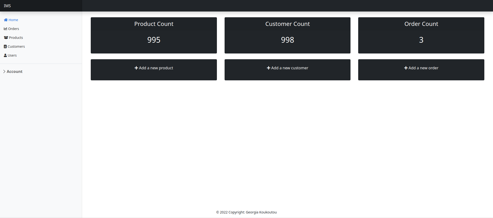
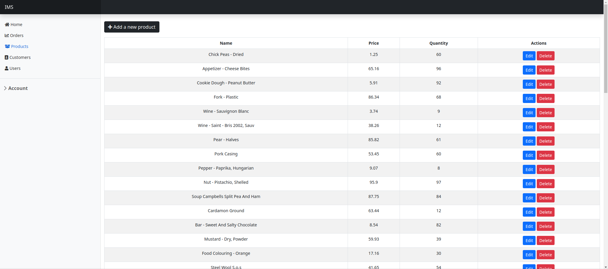
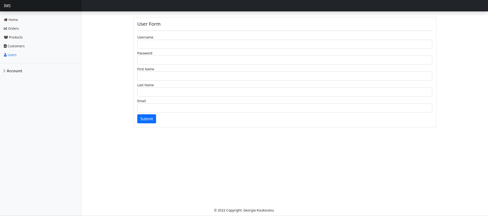
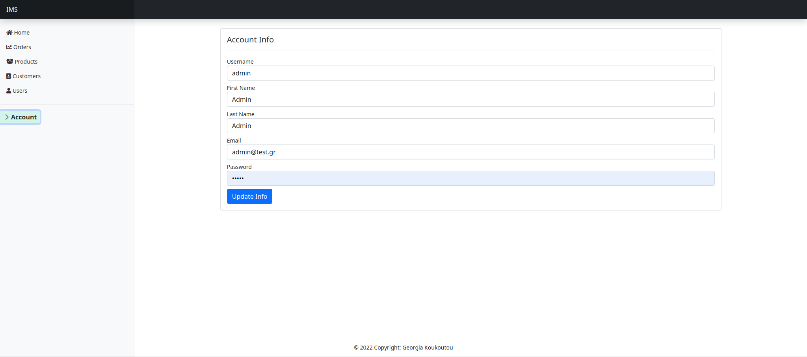

# Sales and Inventory Management System

The project implements a sales and inventory management system where users can track and manage their products, customers and orders. 

Technologies used:
- Spring Boot
- MySQL
- Thymeleaf

## How the application works

When you launch the application for the first time a user with the role admin will be created. You can then use the username 'admin' and the password 'admin' to log in. Only the admin has full access to all the application's features. These include:

- Create/Edit/Delete products.
- Create/Edit/Delete customers.
- Create/Edit/Delete orders.
- Create/Edit/Delete users.

New users can only be created by the admin and can only view the list of products, customers and orders. 

## How to launch the application

1. Make sure you have Java JDK installed.
2. Clone the code: https://github.com/georgia-koukoutou/sales-and-inventory-management-system.git
3. Open the application directory with `cd sales-and-inventory-management-system`
4. Compile the application with `mvn clean package`
4. Run the application using `java -jar target/salesandinventorysystem.jar `
5. Open http://localhost:5000
6. Enjoy the application!

## Application demo

Homepage when signed in as an admin: 

Product list page:

Create new user page:

Account info page:

